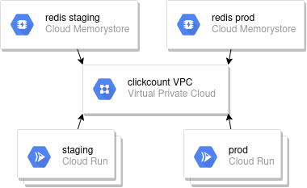

# ClickCount Infra

This project contains all resources required by [clickcount](https://github.com/Krast76/clickcount-app) on Google Cloud Platform.

This project will set a few things :

* All required variables in gitlab clickcount's project
* Enable and create all required services on GCP to host clickcount APP
* Cloud RUN services are not deployed here, clickcount repos handle deployment to Cloud RUN itself

## Schema



## Requirements

### Google Service Account

You only need a GCP access and a [service account key file](https://cloud.google.com/iam/docs/creating-managing-service-account-keys)

The service account should have these rights :

* Create/Update : Network & Subnets & ServerLess VPC Access
* Create/Update : Redis MemoryStore instances

## Terraform 

### Requirement

You need to install [terraform](https://www.terraform.io/downloads.html) on your laptop

No remote state is used here, when you work in a team you have to set a remote state in terraform.

### Variables

Some variables are mandatory

* project : GCP Project to use
* gitlab_token : Gitlab API token used to set variables
* gitlab_project_id : Gitlab project id where Clickcount app is versioned

To set it, you could create a *terraform.tfvars* file as below :

```bash
project = "monprojet"
gitlab_token = "hjlhfkjdhfkj"
gitlab_project_id = 001
```

### Deploy

```bash
export GOOGLE_CREDENTIALS=$PATH_TO_YOUR_KEY
cd terraform
terraform init
terraform apply 
```

When all terraform resources are deployed you will be able to see this output

```
Apply complete! Resources: 14 added, 0 changed, 0 destroyed.

Outputs:

cache_porod_addr = 10.153.139.11
cache_staging_addr = 10.99.220.123
connection_uri = projects/monproject/europe-west4/connectors/vpcconn
registry = gcr.io/monproject
```


## Environnemnet

### Get application URL

Prod :

```bash
$ gcloud run services  describe --platform managed --region $REGION clickcount-prod --format="value(status.url)"
https://clickcount-prod-njhzxpjt7a-ez.a.run.app
```

Staging :

```bash
$ gcloud run services  describe --platform managed --region $REGION clickcount-staging --format="value(status.url)"
https://clickcount-staging-njhzxpjt7a-ez.a.run.app
```

## Destroying

1. Remove all Cloud RUN services

```bash
$ gcloud run services --platform managed --region $REGION delete clickcount-prod
$ gcloud run services --platform managed --region $REGION delete clickcount-staging
```

2. Remove all required infrastructure

```bash
$ cd terraform
$ terraform destroy
```

3. Remove (if needed) all container image in Google Container Registry

## Possible Improvements

* Use GCP [NEG](https://cloud.google.com/load-balancing/docs/negs/setting-up-serverless-negs) or [Domain mapping](https://cloud.google.com/run/docs/mapping-custom-domains) to have a clean APP url
* Trigger Terraform deployment from clickcount repos to have a fully automatized deployment. Thas could be done with [pipeline trigger](https://docs.gitlab.com/ce/ci/triggers/)
* Use Cloud Function and Pub-Sub to trigger event from GCR and automatically update Cloud RUN services' image tag
* Currently the deployment follows the "Blue/Green" pattern, because when a new image is built all traffic is redirected to it. Cloud RUN allows Canary Release deployment pattern. So with cloud run we could redirect 50% to the new image and 50% to the old image
* Better IAM management